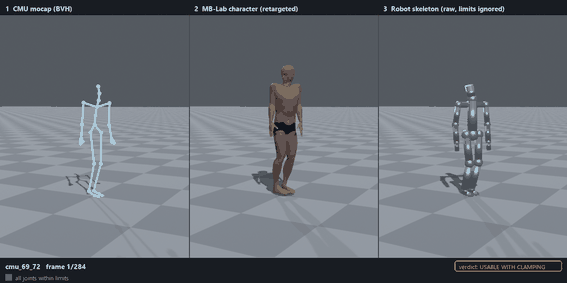

# Humanoid Rig & Motion Retargeting Lab (Blender + MB-Lab)



*Left to right: CMU motion capture, the same motion retargeted onto an MB-Lab character, and onto a generic 28-DoF robot skeleton. Links driven by a joint past its limit turn safety orange. (Clip cmu_69_72: walk up, pick an object up, set it down.)*

## Why a data collection lead should care

On a humanoid team, human demonstrations (mocap, VR teleop, video) are mapped onto a robot's skeleton to become training data. If the human reached somewhere the robot's arm cannot go, bent further than its waist can, or moved faster than its actuators, the "demonstration" is bad data, and nothing in the video shows it. This project builds the pipeline that makes that visible: a realistic character rig, real mocap retargeted onto it and onto a robot skeleton with explicit joint and speed limits, eight kinematics checks (FK, joint limits, velocity, clamping distortion, reach envelope, foot sliding, self-collision, jitter), a per-clip verdict, and an export in a LeRobot-style layout for the companion QA pipeline.

## Headline results (this run, reproducible with `make all`)

| | |
|---|---|
| Clips retargeted (CMU mocap) to MB-Lab **and** robot | **11** (reach, pick/place, squat, bend, carry, box handling, overhead reach, two fast "messy" clips) |
| Frames analysed | **2,824** at 30 Hz (about 94 s of motion) |
| Frames the robot could execute as demonstrated | **50 %** (no position/velocity limit hit, target in reach, no self-collision) |
| Clip verdicts | **0** usable as is, **6** usable with clamping, **5** not feasible |
| Most frequently violated joints (share of all frames past the position limit) | `r_shoulder_yaw` 6.9 %, `r_wrist_yaw` 6.6 %, `head_pitch` 6.4 %, `r_elbow_pitch` 5.4 % |
| FK error, hand vs scaled human target (mean over clips) | **1.67 cm** IK-refined vs **12.4 cm** joint-angle-only |
| Tests / lint | 45 pytest tests green, `ruff` clean |

Things the numbers do and do not say:

* The verdicts depend on a **generic robot I specified** (limits in `config/robot_skeleton.yaml`) and thresholds I chose (`config/thresholds.yaml`). After a first run in which almost every clip failed, I raised the waist-pitch limit (60 to 75 deg), loosened the K4 and K3 fail thresholds, and replaced a flawed foot-sliding definition. No clip is plain "usable" at the 2 % warn threshold. Treat the percentages as a demonstration of the method, not a claim about any real robot.
* `cmu_26_09` ("bend, pick up") is flagged on every frame because the source right hand is twisted about 150 degrees relative to the forearm from the first frame. That looks like a capture/conversion artifact in the CMU file; it is kept as found.
* Reach: the clearest case is picking from the floor (`cmu_69_73`: 20 % of frames have a hand target below the robot's workspace).

Live page: https://futuroinsight.github.io/humanoid-retarget-lab/ · full report: https://futuroinsight.github.io/humanoid-retarget-lab/outputs/sample/report.html (source: `outputs/sample/report.html` and `report.md`); per-clip GIF/MP4 renders in `outputs/sample/renders/`.

## Primer (plain English)

* **Armature / skeleton**: the bones a character is posed with. Each bone has a head and tail position and a length.
* **Hierarchy**: every bone has one parent; moving a parent moves its children. MB-Lab's rig has 71 bones (`docs/mblab_hierarchy.svg`), the robot 28 degrees of freedom (`docs/robot_hierarchy.svg`).
* **Rest pose**: the pose the rig is built in. MB-Lab rests in an A-pose, the CMU data in a T-pose, so rotations cannot be copied raw; each bone gets a rest-pose correction.
* **Joint limits**: min/max angle and max speed per joint. A human shoulder rolls further than most robot shoulders.
* **FK vs IK**: forward kinematics turns joint angles into a hand position; inverse kinematics finds joint angles that put the hand at a wanted position.
* **Retargeting**: moving a motion from one skeleton to another with different proportions and joints. Copying joint rotations keeps the pose but moves the hand to the wrong place; IK fixes the hand.

## What it does

1. **MB-Lab character** built headless (`scripts/create_character.py`), skeleton exported to JSON with a hierarchy diagram.
2. **CMU mocap (BVH) to MB-Lab** with per-bone rest-pose correction, root motion scaled by leg length, baked to a Blender action (`scripts/retarget_to_mblab.py`).
3. **MB-Lab to robot skeleton** (`src/retarget_lab/retarget/to_robot.py`): rotation decomposition onto the robot's joint axes, then optional damped-least-squares IK to the scaled hand position. Two outputs per clip: **raw** (limits ignored) and **clamped** (position limits plus a velocity slew limit).
4. **Checks K1 to K8** and a verdict per clip, **renders** (Eevee, three panels), an HTML/Markdown **report**, and a **LeRobot-style export**.

### Check catalog

| ID | Check | Why it matters for data collection |
|---|---|---|
| K1 | FK verification: hand position from joint angles + link lengths vs the retargeted target (cm) | proves the kinematic chain and solver are right |
| K2 | Joint position-limit violations: share of frames, which joints | a demonstration the robot cannot reproduce is bad training data |
| K3 | Joint velocity-limit violations | humans can move faster than actuators |
| K4 | Clamping distortion: hand position difference raw vs clamped (cm) | how much "fixing" a demo changes the task outcome |
| K5 | Reach envelope: Monte Carlo workspace; frames whose scaled hand target is outside | catches reaches beyond the robot's workspace |
| K6 | Foot sliding: planted-ankle frames that still move | classic retargeting artifact (bad scale/root handling) |
| K7 | Self-collision proxy: forearm/hand capsules vs torso capsule | motion fine for a person can make a robot hit itself |
| K8 | Jitter: high-frequency noise in joint angles | noisy mocap leads to noisy policies |

Verdict rules (`config/thresholds.yaml`): **NOT FEASIBLE** if a K2/K3/K5/K7 fail-level share or the K4 distortion fail level is exceeded; otherwise **USABLE WITH CLAMPING** if any warn-level share is exceeded; otherwise **USABLE**.

### Robot skeleton (generic, **not any real robot**)

Frame: x forward, y left, z up; zero pose = standing with arms hanging down. All numbers are hand-picked and live in `config/robot_skeleton.yaml` (link lengths: thigh/shank 0.40 m, upper arm 0.28, forearm 0.26, hand 0.12). Right-side joints mirror the left (same limits). Axes are in the parent frame; the sign convention is in `docs/conventions.md`.

| chain | joint | axis | limits (deg) | max speed (deg/s) |
|---|---|---|---|---|
| waist | waist_yaw | +z | -60 to 60 | 120 |
| waist | waist_pitch | +y | -25 to 75 | 120 |
| head | head_yaw | +z | -70 to 70 | 200 |
| head | head_pitch | +y | -30 to 45 | 200 |
| L/R arm | shoulder_pitch | -y | -60 to 165 | 180 |
| L/R arm | shoulder_roll | +x (L), -x (R) | -25 to 135 | 180 |
| L/R arm | shoulder_yaw | +z (L), -z (R) | -80 to 80 | 220 |
| L/R arm | elbow_pitch | -y | 0 to 135 | 240 |
| L/R arm | wrist_yaw | +z (L), -z (R) | -90 to 90 | 300 |
| L/R arm | wrist_pitch | -y | -60 to 60 | 300 |
| L/R leg | hip_yaw | +z (L), -z (R) | -45 to 45 | 250 |
| L/R leg | hip_roll | +x (L), -x (R) | -30 to 45 | 250 |
| L/R leg | hip_pitch | -y | -30 to 120 | 250 |
| L/R leg | knee_pitch | +y | 0 to 135 | 300 |
| L/R leg | ankle_pitch | -y | -40 to 40 | 250 |
| L/R leg | ankle_roll | +x (L), -x (R) | -25 to 25 | 250 |

## How this fits the portfolio

MB-Lab rig, then robot-skeleton trajectories, then the **Robot Demonstration Data QA Pipeline**: `outputs/<run>/export/` (`meta/info.json`, `meta/episodes.csv`, `meta/tasks.csv`, `data/frames.csv`) is laid out like LeRobot-style datasets, with the feasibility verdict in `episodes.csv`. Waldo Academy produces operator data in the same format, so the same checks apply to it. I did not have the QA pipeline's adapter available, so ingestion there is untested; see `DECISIONS.md`.

## Versions and character-creation path

* **Blender 4.0.2** (portable zip) and **MB-Lab 1.8.1** (final release; requires Blender >= 4.0), both pinned and kept in `tools/` (gitignored).
* **Character creation: scripted/headless** (`bpy.ops.mbast.init_character()`, character `m_ca01`, male). `docs/character_setup.md` has the install steps and a manual fallback.
* Analysis environment: Python 3.14 venv (the spec asked for 3.11; `requires-python >= 3.11`), numpy/scipy/pandas/pyarrow/matplotlib/jinja2/typer.

License: MIT (`LICENSE`). Data and tools keep their own licenses (see `data/SOURCES.md`).

## Reproduce

```bash
python -m venv .venv && .venv/Scripts/python -m pip install -e ".[dev]"
# put Blender 4.0.2 in tools/blender/ and MB-Lab 1_8_1 in tools/blender_user/addons/mblab/  (docs/character_setup.md)
make data        # downloads the 11 CMU BVH clips (~15 MB) listed in config/default.yaml (sources: data/SOURCES.md)
make all         # character -> skeletons -> retarget -> checks -> renders -> report -> export (~15 min, mostly Eevee)
make test lint
```

`python -m retarget_lab run --clips cmu_69_72 --skip-render` runs a single clip in about 30 seconds; `--skip-blender` redoes only the analysis from existing Blender outputs.

## Repo layout

`index.html` (GitHub Pages landing page) · `index.html` (GitHub Pages landing page) · `config/` (robot, thresholds, bone map, run config) · `scripts/` (Blender-side, `bpy`) · `src/retarget_lab/` (testable analysis package: `bvh`, `skeleton`, `kinematics/`, `retarget/`, `checks`, `report`, `export`, ...) · `tests/` · `templates/report.html.j2` · `docs/` · `outputs/sample/` (the committed sample run; Blender intermediates are gitignored) · `DECISIONS.md` (every deviation from the spec).

## Limitations

* **Generic robot skeleton**, not any real robot's specs; limits, velocities, link lengths and verdict thresholds are my choices.
* **Simplified collision model**: forearm/hand capsules vs one torso capsule only; no head, legs or arm-to-arm.
* **Mocap from one public dataset** (CMU, a few subjects), 10-second windows of 11 clips; not a representative demonstration set.
* No wrist or waist roll, so those components of the human motion are least-squares dropped; legs are checked against limits only (no balance, no foot planting); no finger retargeting.
* The mocap stick figure keeps the CMU subject's proportions (shorter torso, longer arms than the MB-Lab character), which is why rotation-only retargeting misses hand positions by about 12 cm and IK is needed.
* The MediaPipe video stretch (`scripts/video_to_pose.py`) is only half verified: the landmark-to-BVH conversion is unit-tested with synthetic landmarks, but the MediaPipe capture has not been run.

## Next steps

Hand/finger retargeting; retargeting operator data from Waldo Academy; running `video_to_pose.py` on a phone video of a real task (links to the WeldForge capture idea); calibrating the robot spec and thresholds against a real robot.
