# Retargeting quality report: run `sample`

## 1. Summary

- Clips processed: **11**; frames analysed: **2824** at 30 Hz
- Frames executable as demonstrated: **50%**
- Verdicts: USABLE WITH CLAMPING: 6, NOT FEASIBLE: 5
- Top violating joints (share of frames past position limit): r_shoulder_yaw 7%, r_wrist_yaw 7%, head_pitch 6%, r_elbow_pitch 5%, l_shoulder_yaw 5%

## 2. Skeleton overview

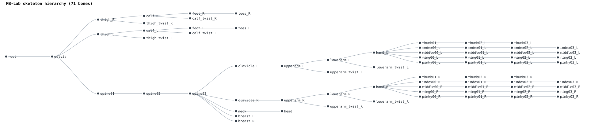

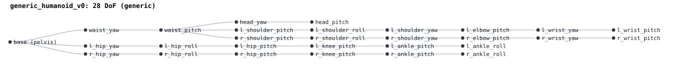

| chain | joint | axis | lo (deg) | hi (deg) | max vel (deg/s) |
|---|---|---|---|---|---|
| waist | waist_yaw | +0 +0 +1 | -60 | 60 | 120 |
| waist | waist_pitch | +0 +1 +0 | -25 | 75 | 120 |
| head | head_yaw | +0 +0 +1 | -70 | 70 | 200 |
| head | head_pitch | +0 +1 +0 | -30 | 45 | 200 |
| left_arm | l_shoulder_pitch | +0 -1 +0 | -60 | 165 | 180 |
| left_arm | l_shoulder_roll | +1 +0 +0 | -25 | 135 | 180 |
| left_arm | l_shoulder_yaw | +0 +0 +1 | -80 | 80 | 220 |
| left_arm | l_elbow_pitch | +0 -1 +0 | 0 | 135 | 240 |
| left_arm | l_wrist_yaw | +0 +0 +1 | -90 | 90 | 300 |
| left_arm | l_wrist_pitch | +0 -1 +0 | -60 | 60 | 300 |
| right_arm | r_shoulder_pitch | -0 -1 -0 | -60 | 165 | 180 |
| right_arm | r_shoulder_roll | -1 +0 -0 | -25 | 135 | 180 |
| right_arm | r_shoulder_yaw | -0 +0 -1 | -80 | 80 | 220 |
| right_arm | r_elbow_pitch | -0 -1 -0 | 0 | 135 | 240 |
| right_arm | r_wrist_yaw | -0 +0 -1 | -90 | 90 | 300 |
| right_arm | r_wrist_pitch | -0 -1 -0 | -60 | 60 | 300 |
| left_leg | l_hip_yaw | +0 +0 +1 | -45 | 45 | 250 |
| left_leg | l_hip_roll | +1 +0 +0 | -30 | 45 | 250 |
| left_leg | l_hip_pitch | +0 -1 +0 | -30 | 120 | 250 |
| left_leg | l_knee_pitch | +0 +1 +0 | 0 | 135 | 300 |
| left_leg | l_ankle_pitch | +0 -1 +0 | -40 | 40 | 250 |
| left_leg | l_ankle_roll | +1 +0 +0 | -25 | 25 | 250 |
| right_leg | r_hip_yaw | -0 +0 -1 | -45 | 45 | 250 |
| right_leg | r_hip_roll | -1 +0 -0 | -30 | 45 | 250 |
| right_leg | r_hip_pitch | -0 -1 -0 | -30 | 120 | 250 |
| right_leg | r_knee_pitch | -0 +1 -0 | 0 | 135 | 300 |
| right_leg | r_ankle_pitch | -0 -1 -0 | -40 | 40 | 250 |
| right_leg | r_ankle_roll | -1 +0 -0 | -25 | 25 | 250 |

## 3. Per-clip verdicts

| clip | task | verdict | feasible frames | K2 | K3 | K4 cm | K5 | K7 |
|---|---|---|---|---|---|---|---|---|
| cmu_69_72 | walk up to an object, pick it up, set it down elsewhere | **USABLE WITH CLAMPING** | 66% | 15% | 21% | 5.4 | 15% | 0% |
| cmu_69_73 | walk up, lean over, pick up an object, set it down elsewhere | **NOT FEASIBLE** | 64% | 20% | 21% | 9.2 | 20% | 2% |
| cmu_69_70 | walk up, squat, pick up an object, set it down elsewhere | **USABLE WITH CLAMPING** | 67% | 26% | 8% | 0.0 | 0% | 6% |
| cmu_69_69 | walk forward, pick up an object, carry it back | **NOT FEASIBLE** | 52% | 24% | 13% | 2.1 | 11% | 20% |
| cmu_70_01 | carry a 5.5 lb suitcase (walking) | **USABLE WITH CLAMPING** | 96% | 0% | 4% | 0.0 | 0% | 0% |
| cmu_26_09 | bend over and pick up | **NOT FEASIBLE** | 0% | 100% | 1% | 1.5 | 0% | 0% |
| cmu_62_20 | close, move and open a box | **USABLE WITH CLAMPING** | 66% | 10% | 29% | 1.2 | 0% | 2% |
| cmu_15_06 | lean forward and reach for something | **USABLE WITH CLAMPING** | 68% | 1% | 30% | 4.9 | 0% | 1% |
| cmu_14_07 | jump up to grab, reach, tiptoe (overhead reach) | **NOT FEASIBLE** | 2% | 97% | 39% | 16.3 | 0% | 0% |
| cmu_14_01 | boxing (fast, messy) | **NOT FEASIBLE** | 7% | 56% | 52% | 12.3 | 0% | 6% |
| cmu_56_02 | vignettes: wipe window, stretch, grab, smash (messy) | **USABLE WITH CLAMPING** | 72% | 13% | 10% | 0.9 | 0% | 5% |

## 4. Joint-angle plots

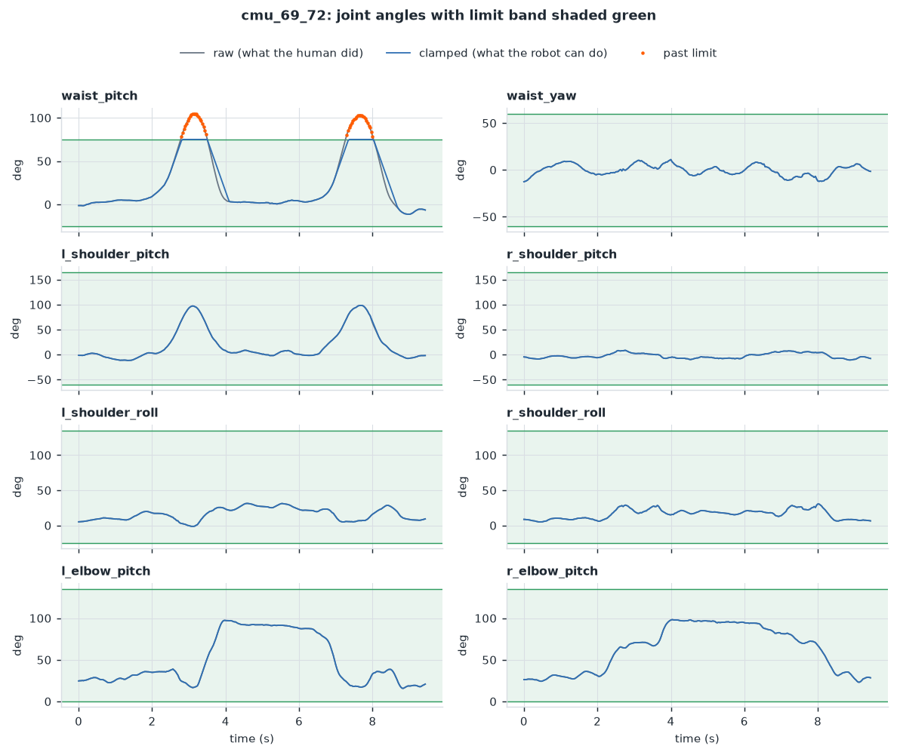

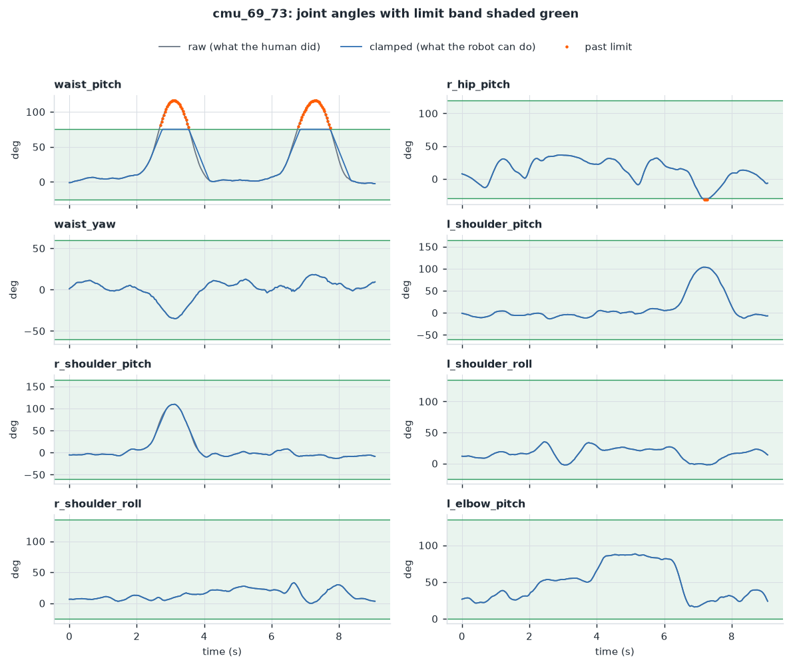

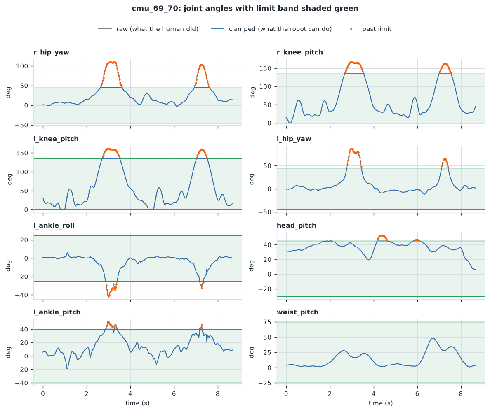

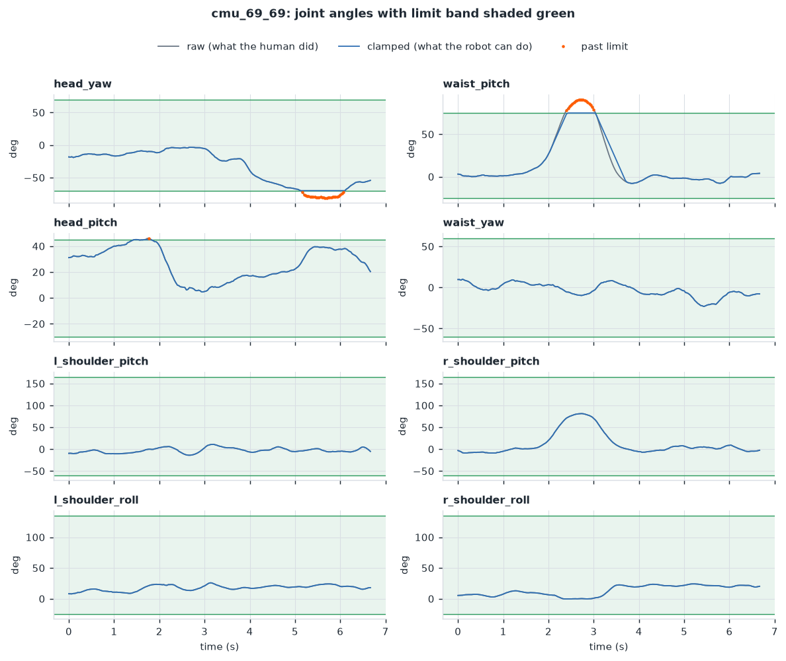

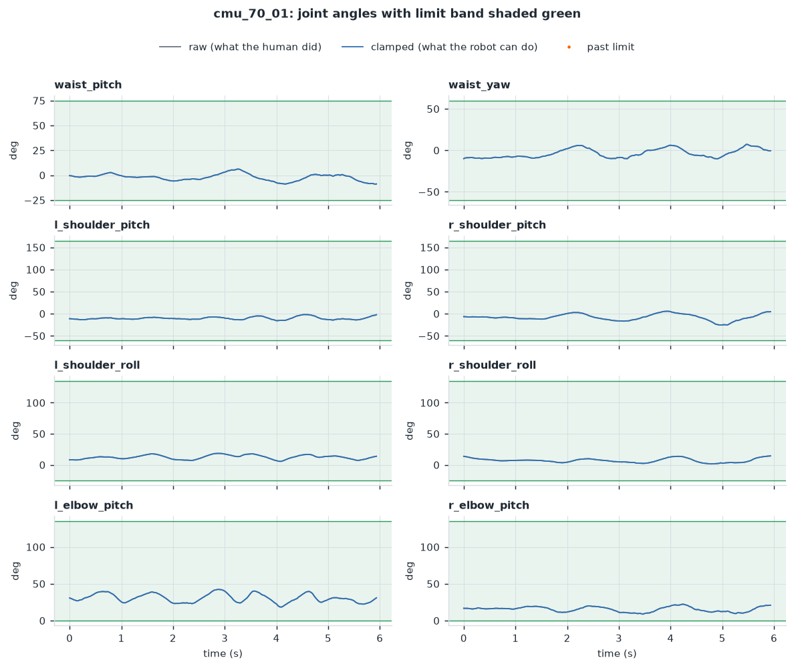

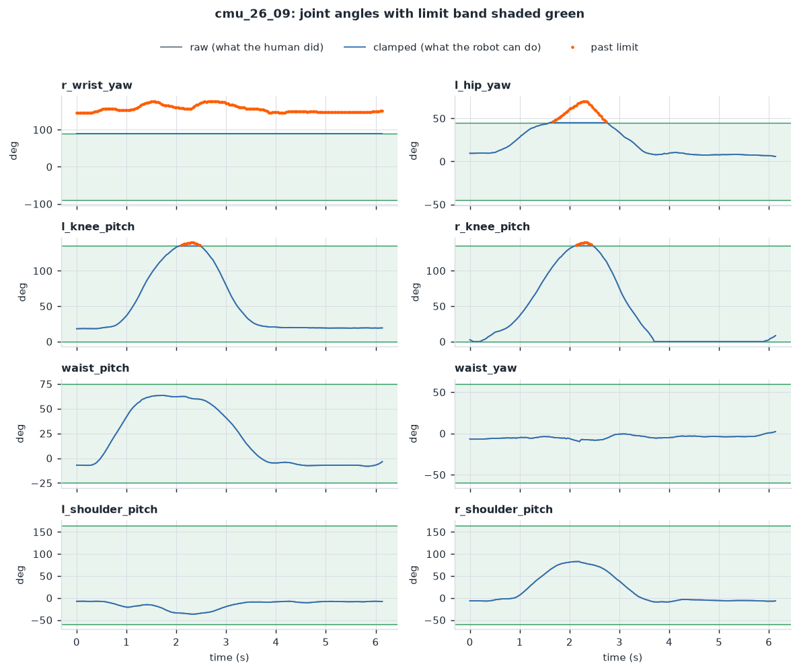

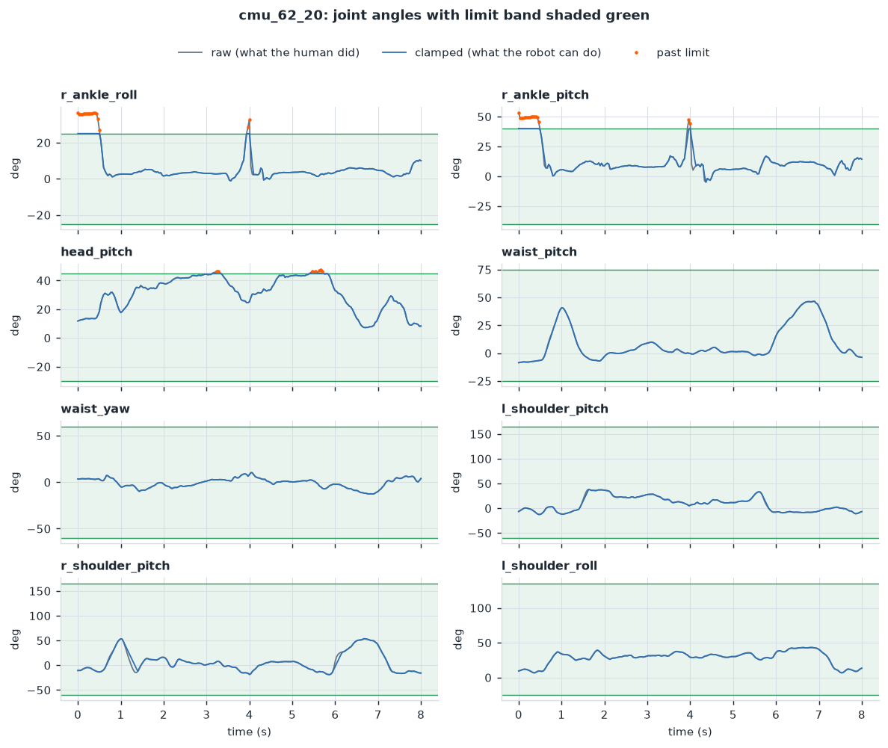

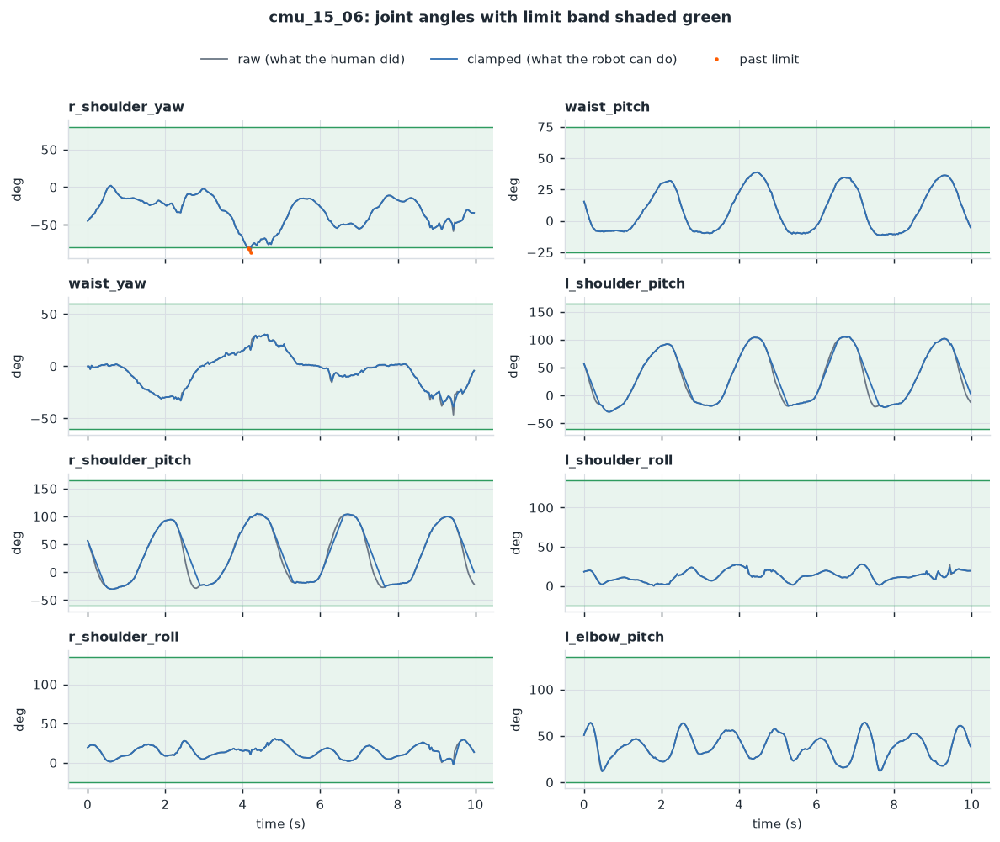

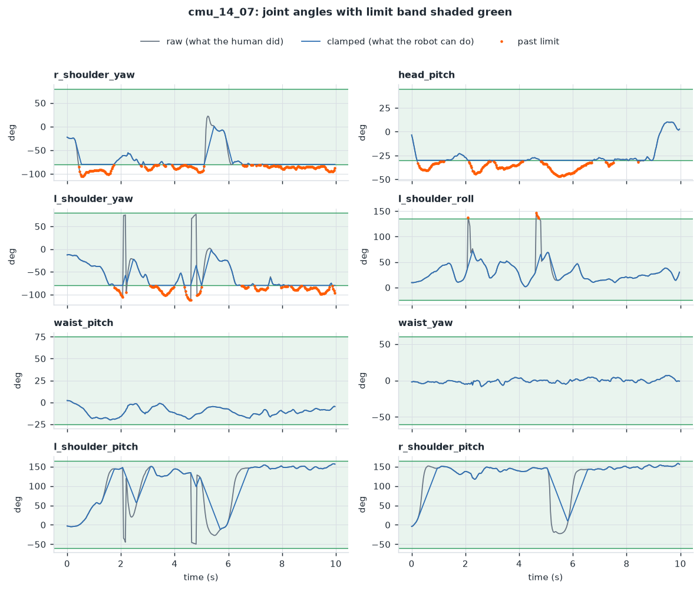

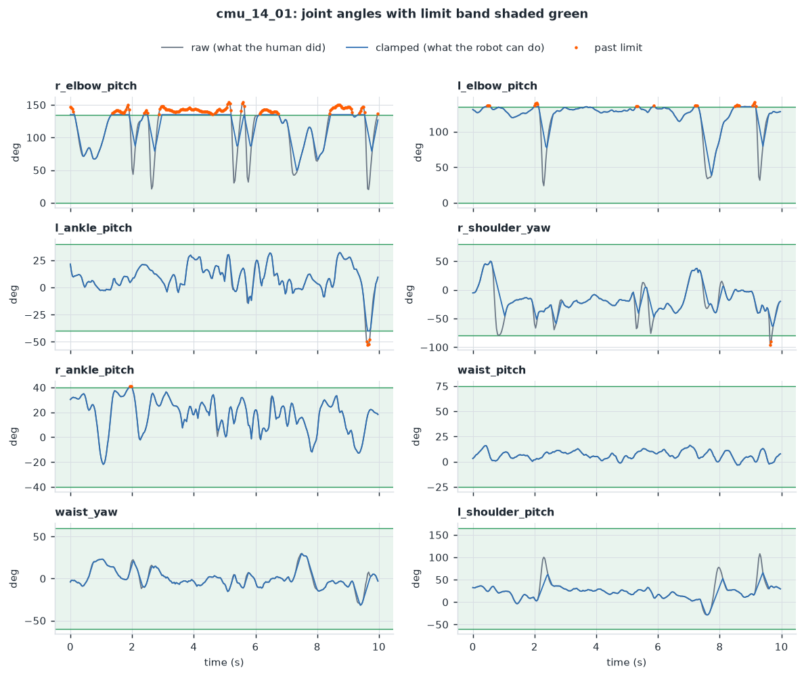

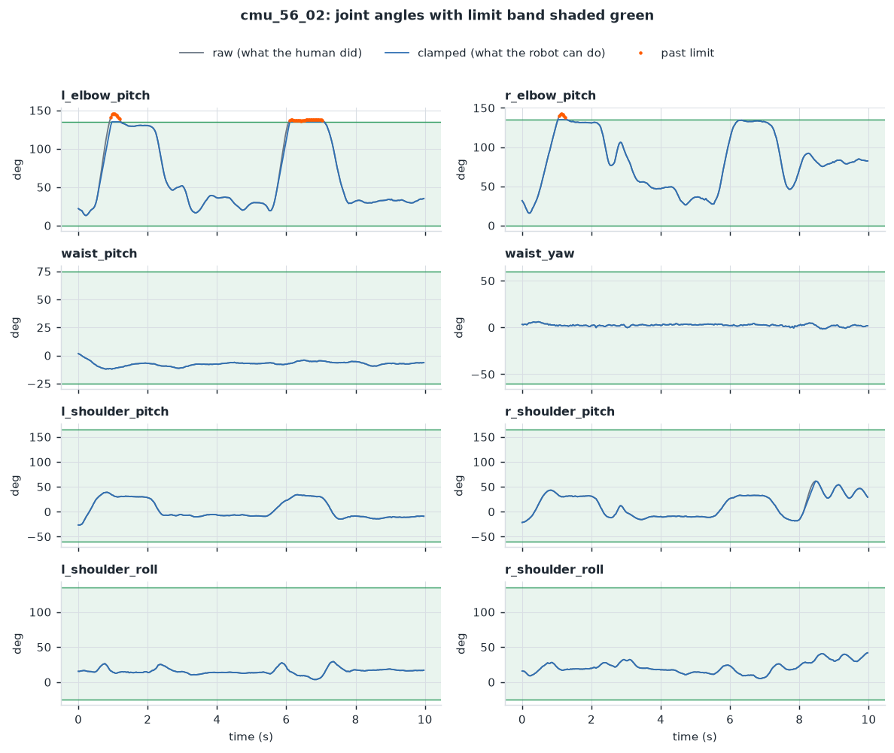

## 5. Reach envelope

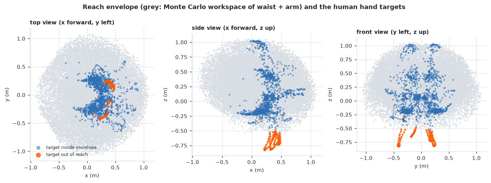

## 6. Retargeting method comparison

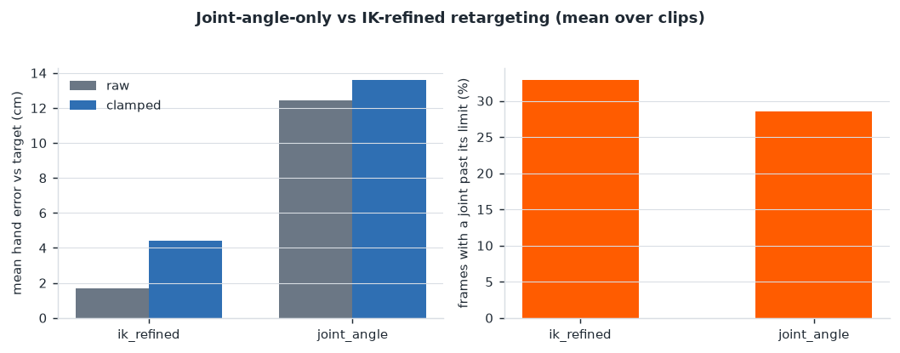

| method | mean FK error (cm) | clamped FK error (cm) | frames past a limit |
|---|---|---|---|
| ik_refined | 1.67 | 4.39 | 33% |
| joint_angle | 12.44 | 13.59 | 29% |

## 7. What this means for data collection

1. **Only 50% of the analysed frames are executable as demonstrated.** Of 11 clips, 0 are usable as is, 6 need clamping and 5 are not feasible for this robot. Raw human demonstrations should never go into training un-audited.
2. **Violations concentrate in a few joints:** r_shoulder_yaw (7% of frames), r_wrist_yaw (7% of frames), head_pitch (6% of frames). Those are the joints to watch in demonstration review, and the first candidates for a hardware or protocol change.
3. **Reach is a task-design problem.** The worst reach case is cmu_69_73 (walk up, lean over, pick up an object, set it down elsewhere): 20% of frames have a hand target outside the robot's workspace. Protocol fix: mark a reach zone on the table or shelf and have operators keep objects inside it.
4. **Motion type predicts feasibility.** Mean share of frames past a position limit by task type: overhead_reach 97%, bend_pick 60%, messy 34%, squat_pick 26%, pick_place 15%, carry 12%, manipulation 10%, reach 1%. Task types at the top of that list are where human range exceeds the robot's, so they are the ones to design around (different object placement, a different robot, or exclude from training).
5. **Speed matters as much as range.** cmu_14_01 has 52% of frames above a joint velocity limit. Clamping a fast demonstration makes the robot lag it, which moves where the hand ends up (K4: up to 16.3 cm mean). An operator pacing guideline is the first protocol change to try; this run does not test whether it works.

## 8. Methodology and limitations

See `report.html` section 8 and the README.
